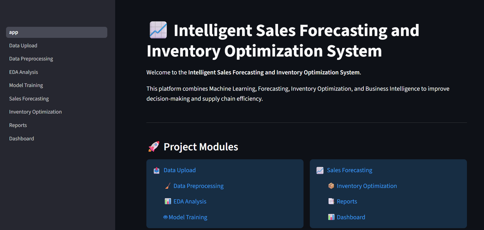

# 📈 Intelligent Sales Forecasting and Inventory Optimization System

A Streamlit-based machine learning platform for sales forecasting, inventory optimization, and business intelligence with interactive dashboards and analytics.

---

## 🚀 Live Demo

🔗 **Live Application:** *(Add Render/Streamlit deployment link here)*

---

---

## 📷 Output

### Home Page

<p align="center">
  
</p>

### Data Upload

<p align="center">
  
</p>

### Data Preprocessing

<p align="center">
  
</p>

### EDA Analysis

<p align="center">
  
</p>

### Model Training

<p align="center">
  
</p>

### Sales Forecasting

<p align="center">
  
</p>

### Inventory Optimization

<p align="center">
  
</p>

### Reports

<p align="center">
  
</p>

### Dashboard

<p align="center">
  
</p>

---

## 📌 Features

* 📤 Data Upload
* 🧹 Data Preprocessing
* 📊 Exploratory Data Analysis (EDA)
* 🤖 Machine Learning Model Training
* 📈 Sales Forecasting
* 📦 Inventory Optimization
* 📑 Reports Generation
* 📊 Interactive Dashboard

---

## 🛠 Technologies Used

* Python
* Streamlit
* Pandas
* NumPy
* Scikit-Learn
* Plotly
* Joblib

---

## 📂 Project Structure

```text
Intelligent_Sales_Forecasting
│
├── app.py
├── dataset
├── models
├── outputs
├── pages
├── utils
├── requirements.txt
├── README.md
└── logo.png
```


## ⚙ Installation

```bash
git clone https://github.com/YOUR_USERNAME/Intelligent-Sales-Forecasting-and-Inventory-Optimization-System.git

cd Intelligent-Sales-Forecasting-and-Inventory-Optimization-System

pip install -r requirements.txt

streamlit run app.py
```

---

## 🎯 Objectives

* Predict future sales accurately.
* Optimize inventory levels.
* Improve supply chain efficiency.
* Provide business intelligence dashboards.
* Reduce inventory costs and maximize profitability.

---

## 👨‍💻 Author

Developed as a Machine Learning and Business Intelligence Project using Streamlit and Scikit-Learn.
